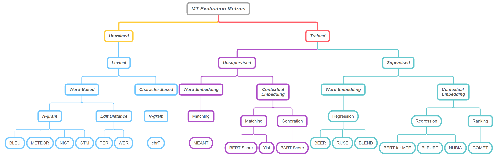

# RAG란?, RAG 평가지표

## RAG란? [RAG_paper](https://arxiv.org/abs/2005.11401) , [참고 글1](https://modulabs.co.kr/blog/retrieval-augmented-generation/) , [참고 글2](https://jeonsworld.github.io/NLP/rag/)

RAG(Retrieval-Augmented Generation)는 LLM의 한계를 극복하기 위해 제안된 기술이다. LLM은 방대한 양의 텍스트 데이터를 사전 학습하여 강력한 언어 이해 및 생성 능력을 갖추고 있지만, 학습 데이터에 없는 최신 정보나 특정 도메인 지식은 제공하기 어렵다는 단점이 있다. RAG는 이러한 LLM의 한계를 극복하기 위해 ‘Retrieval’과 ‘Language generation’을 결합한 프레임워크다. RAG의 기본 아이디어는 질문에 답하기 위해 필요한 지식을 외부 데이터베이스에서 검색하여 활용하는 것이다.

RAG의 논문에서는 “Pre-trained language model (ex : LLM)은 factual knowledge를 매개변수에 저장하고 downstream NLP task에 대해 fine-tuning을 수행할 때 좋은 결과를 얻는 것으로 나타났지만 knowledge에 접근하고 정확하게 조작하는 것은 여전히 제한되어 있으므로 knowledge-intensive task에 대해서는 task-specific architecture(question answering or text summarization 등)보다 성능이 떨어진다. (즉 LLM은 범용성은 좋으나 각각의 task에서는 task-specific model 보다 성능이 떨어짐) pre-trained 모델과 non-parametric memory를 결합한 RAG(Retrieval-Augmented Generation)를 제안한다”고 하였다.

- LLM의 단점
    1. 편향성 문제
        - 학습 데이터에 내재된 편향성을 그대로 반영할 수 있음
        - 성별, 인종, 종교 등에 대한 고정관념이나 차별적 표현을 생성할 위험 존재
    2. 사실 관계 오류 가능성
        - 방대한 데이터를 학습하지만, 항상 정확한 정보를 제공하지는 않음
        - 잘못된 정보나 허위 정보를 진실로 간주하고 전파할 수 있음
    3. 맥락 이해의 한계
        - 문장 단위의 이해는 가능하지만, 장문의 글이나 복잡한 맥락 파악은 어려울 수 있음
        - 세계 지식과 상식 추론 능력이 부족하여 심층적인 이해에 한계 존재
    4. 일관성 문제
        - 동일한 입력에 대해 일관된 답변을 생성하지 않을 수 있음
        - 모델의 확률적 특성상 생성 결과가 매번 달라질 수 있어 신뢰성 저하
    5. 윤리적 문제
        - 악용 가능성이 존재하며, 책임 소재 파악이 어려울 수 있음
        - 모델의 출력 결과에 대한 통제와 검증 체계 마련 필요
- 개선할 단점
    1. 외부 지식 활용 (이 경우 특정 도메인의 보안 등의 문제로 LLM 자체에 학습시킬 수 없는 데이터 활용 가능)
        - 대규모의 구조화된 지식 베이스(예: 위키피디아)를 모델에 연결
        - 주어진 질의에 대한 관련 정보를 지식 베이스에서 검색 및 추출
    2. 증거 기반 생성(왜?)
        - 검색된 지식 정보를 증거로 활용하여 보다 사실에 기반한 답변 생성
        - 생성된 답변의 출처를 명시함으로써 신뢰성 향상
    3. 맥락 이해력 향상(왜?)
        - 외부 지식을 통해 질의에 대한 배경 지식과 맥락 정보를 파악
        - 단순한 패턴 매칭이 아닌 추론 능력을 바탕으로 한 답변 생성

### **RAG의 주요 구성 요소**

1. Query Encoder : 사용자의 질문을 이해하기 위한 모델로, 주어진 질문을 벡터 형태로 인코딩한다. BERT와 같은 모델을 사용하여 단어 혹은 패시지를 인코딩한다.
2. Knowledge Retriever : 인코딩된 질문을 바탕으로 외부 지식 베이스에서 관련 정보를 검색한다. 검색 기반 모델은 주어진  질문과 외부 데이터베이스의 관련된 정보(데이터베이스의 문장)의 유사도를 비교하여 매치한다.
    - 💡ex)
        - 질문 : "What is the capital of France?”
        - 문서(패시지) 데이터베이스 :
            
            패시지 1: "Paris is the capital and most populous city of France."
            
            패시지 2: "The Eiffel Tower is located in Paris."
            
            패시지 3: "Berlin is the capital of Germany
            
        
        질문과 데이터베이스의 패시지를 인코딩한다. RAG의 논문에서 사용한 DRP의 경우 word2vec이 아닌 전체 문장을 latent space로 projection시켜 하나의 고차원 벡터로 임베딩한다. 그 후 질문과 데이터베이스의 벡터 유사도 계산(주로 코사인 유사도)을 통해 가장 높은 유사도를 가진 패시지를 반환 한다.
        
        - 출력 : "Paris is the capital and most populous city of France.”
        
3. Knowledge-Augmented Generator :  질문과 Knowledge Retriever에서 얻은 유사도가 높은 정보를 같이 사용하여 사용자의 질문에 대한 답변을 생성한다. 검색된 지식을 추가 입력으로 받아 기존의 LLM보다 정확한 답변을 생성할 수 있다. RAG 논문에서의 경우는 질문과 retrieved content를 concatenation하였다.

RAG는 외부 지식 베이스의 정보를 결합하여 입력을 증강시켜 보다 정확하고 , 출력 결과에 대한 외부데이터의 근거를 제시 할 수 있어 설명 가능성과 신뢰성을 높일 수 있다.

RAG 기술은 정보 검색, 팩트 체킹, 질의응답, 등의 task에서 활발히 연구되고 있다. 한계점으로는 연결된 지식 베이스에 의존하므로, 연결된 지식 베이스의 관리와 품질과 커버리지를 향상 시키기 위한 기법에 대한 연구가 중요한 과제로 남아있다.

- 💡개인 의견
    
    과제에 참여된 각 도메인의 지식베이스를 이용하여 벤치마크 데이터셋을 만드는 것도 고려해 볼 수 있을 것 같다.
    

## LLM 품질 평가 기술

Machine Translation평가 지표들

Taxonomy of automatic evaluation metrics. [(그림 출처,A Survey on Evaluation Metrics for Machine Translation)](https://www.mdpi.com/2227-7390/11/4/1006)

[Ref 1](https://blog.testworks.co.kr/ai_llm_evaluation_1/) , [Ref 2](https://blog.testworks.co.kr/ai_llm_evaluation_2/)
**BLEU (BiLingual Evaluation Understudy Score)**

초기에는 기계 번역에서 품질을 평가하기 위해 개발되었으나, 현재는 활용 범위가 확장되어 번역 뿐 만 아니라 정답 문장과 비교를 하기 위해서도 사용된다. 언어 모델의 출력이 사람이 작성한 텍스트에 얼마나 가까운 지를 평가한다. BLEU 점수는 0에서 1까지이며, 점수가 1에 가까울수록 사람이 작성한 참조 번역과 유사성이 높다는 것을 의미한다. BLEU의 n-gram의 precision은 아래의 식과 같이 정의 된다.

$p_n = \frac{the\ number\ of\ N-gram\ which\ occur\ in\ any\ Reference}{the\ total\ number\ of\ N-gram\ in\ candidate}$

- 💡n-gram이란?
    
    **n**개의 연속된 단어 또는 토큰의 시퀀스
    ex) “The cat sat”
    
    1-gram(Unigram) : ["The", "cat", "sat"]
    2- gram(Bigram) : ["The cat", "cat sat"]
    
    3-gram(Trigram) : ["The cat sat"]
    

n-gram에서 n의 값을 1~4등으로 하여 각각의 n-gram에 대하여 점수를 계산한 후 평균값을 사용한다. N 마다 가중치나 패널티를 설정하여 BLEU를 계산하기도 한다.

이때 패널티를 주는 기법으로 Brevity Penalty이 있다. 생성된 문장의 길이를 c, 정답 문장의 길이를 r 이라고 한다면 Brevity Penalty는 아래의 식과 같이 계산된다.

$$
BP = \begin{cases} 1, &\text{if } c>r\\ e^{(1-r/c)}, &\text{if } c<=r\end{cases}
$$

BLEU는 최종적으로 다음 식과 같이 계산된다.

$$
BLEU = BP\cdot exp(\displaystyle\sum_{i=1}^n w_n log p_n)
$$

BLUE는 간단하고 직관적인 계산 방법 때문에 널리 사용되나 참조 번역의 품질에 영향을 받고 계산 수식이 n-gram의  일치도만 고려하기 때문에  문맥,문장의 의미, 문법적 구조를 제대로 반영하지 못한다는 한계점이 있다. 

**METEOR (Metric for Evaluation of Translation with Explicit ORdering)**

BLEU는 가장 대중적으로 사용되는 평가 지표 중 하나이지만, 한계점이 존재한다. BLEU의 단점을 극복하여 문장의 질을 평가하기 위해 METEOR라는 평가 기법이 제시 되었다. METEOR은 unigram 단위에서의 recall과 precision의 조화평균값을 구한다.

- 💡조화 평균이란
    
    조화평균은 '역수의 산술평균의 역수'이다. 역수의 차원에서 평균을 구하고, 다시 역수를 취해 원래 차원의 값으로 돌아오는 것이다. 
    
    ex) 갈 때 10m/s, 올때 20m/s 로 주행하였다. 평균 속력은?
    
    10과 20의 산술 평균인 15는 답이 아니다. 갈 때와 올 때 투여한 시간이 다르기 때문이다. 여기서는 시간의 차원에서 평균을 구해야 한다. 거리를 속력으로 나누면(역수), 시간인데, 이 **시간의 평균**을 구한 후에, 구한 시간 값에 대해, 다시 속력으로 바꾼 것이 평균 속력이다.
    거리를 S라 하고, 시간에 대해 식을 세우면 다음과 같다.
    
    $$
    \frac{S}{10} + \frac{S}{20} = \frac{2S}{x}
    $$
    
    이때 $x = \frac{40}{3}$ 이 된다.이 예제를 일반화하여,  갈 때 속력을 a, 올 때 속력을 b라 하여 정리하면, 조화평균은 다음 식과 같이 된다.
    
    $$
    x = \frac{2ab}{a+b}
    $$
    

recall과 precision에 1:9로 가중치를 두고 조화 평균을 구하며 아래 식과 같이 조화 평균을 계산한다.

$$
F_{mean} = \frac{10PR}{R+9P}
$$

$$
METEOR = F_{mean}(1-0.5(\frac{c}{u_m})^3)
$$

**GLUE (General Language Understanding Evaluation)**

2019년 BERT paper가 발표되면서 등장한 평가지표이다. 자연어 이해(NLU) 태스크를 모아놓은 벤치마크이다. 포함된 벤치마크는 아래와 같다.

- GLUE에 포함된 벤치마크
    - Quora Question Pairs (QQP, 문장 유사도 평가)
    - Question NLI (QNLI, 자연어 추론)
    - The Stanford Sentiment Treebank (SST, 감성 분석)
    - The Corpus of Linguistic Acceptability (CoLA, 언어 수용성)
    - Semantic Textual Simiilarity Benchmark (STS-B, 문장 유사도 평가)
    - Microsoft Research Paraphrase Corpus (MRPC, 문장 유사도 평가)
    - Recognizing Textual Entailment (RTE, 자연어 추론)
    - SQUAD 1.1 / 2.0 (질의응답)
    - MultiNLI Matched (자연어 추론)
    - MultiNLI Mismatched (자연어 추론)
    - Winograd NLI (자연어 추론)

자연어 이해 모델을 위한 평가 지표로 주로 사용되지만 자연어 생성 모델을 평가하기 위한 지표에 포함되기도 한다. GLUE는 영어에만 적용되는 평가 지표이기 때문에 각 언어에 따라 KLUE(한국어), CLUE(중국어)

- 💡개인 생각
    
    KLUE, CLUE 처럼 의료, 법률, 제조, 미디어 각각을 위한 평가지표나 데이터셋 구축 시도도 할 수 있을 것으로 보임.
    

**CIDEr (Consensus-based Image Description Evaluation)**

CIDEr은 TF-IDF( Term Frequency-Inverse Document Frequency)를 기반으로 한다. TF(단어 빈도) ‘한 문장 안에 같은 단어가 여러 번 등장할 경우 중요성이 높을 가능성이 크다’ 를 가정하여, 해당 n-gram이 정답 문장 각각에서 몇 번이나 등장 했는지를 본다. ID(Inverse Document Frequency)는 정답 문장 중 몇 군데에서나 해당 n-gram이 등장하는지를 나타내는 DF에 역수와 log를 순서대로 취한 값이다. ‘특정 단어가 여러 문서(사진)에서 공통적으로 발견된다면 오히려 핵심이 되는 단어가 아니다’ 를 가정하여 역수를 취한다.

이 TF-IDF 값을 생성된 문장과 정답 문장에서 n-gram(1≤n≤4)에 대해 실시한 후, 그 값을 벡터로 나타낸다. 정답 문장과 생성된 문장 벡터의 코사인 유사도를 구하고 가중치를 부여하여 평균을 내서 CIDEr 점수를 계산한다.

**SPICE (Semantic Propositional Image Caption Evaluation)**

SPICE (Semantic Propositional Image Caption Evaluation)은 지금까지의 평가지표와는 다르게 n-gram을 사용하지 않는 평가 지표입니다. 여기서는 정답 문장이 여러 개 있는 것에 착안하여, 정답 문장들의 단어들을 Object, Attribute Relation으로 구분하고 이 관계를 나타내는 그래프를 그립니다.

**MMLU (Massive Multitask Language Understanding)**

MMLU는 모델이 사전 학습 동안 내재한 지식을 평가하려는 목적을 가지고 개발되었다. STEM, 인문학, 사회 과학 등 57개의 과목을 다루며 다양한 분야의 질문들이 모여 있다. 모델은 질문이나 지문을 읽고, 4개의 선택지 중 적합한 것을 고르고 이를 기준으로 모델을 평가한다. 다양한 분야의 과목을 포함하고 있어 모델의 약점을 파악하는데 사용한다.

**BIG-Bench**

2022년에 구글에서 주관하여 구축한 벤치마크로 BIG(Beyond the Imitation Game)-Bench는 200개가 넘는 유형의 문제들로 구성된 벤치마크 데이터셋이다. 이 중에서 평균적인 사람의 점수를 넘지 못한 유형을 따로 묶어 BBH(Big-Bench-Hard)라고 부르기도 한다.

단순한 평가를 넘어 공개적으로 리더보드를 열어 경쟁을 유도하는 경우도 있습니다. AIhub 홈페이지에 공개되어 있는 Open Ko-LLM Leaderboard ( [https://www.aihub.or.kr/leaderboard/view.do](https://www.aihub.or.kr/leaderboard/view.do) )가 대표적인 예입니다. 여기서는 모델을 총 다섯가지 분야(추론능력, 상식능력, 언어이해력, 환각방지능력, 한국어 상식생성능력)에 대해서 평가하고, 그 성적을 순위표에 기록합니다.

**서비스 수준에서 평가하는 방법과, 그 방법을 마련하는 기준**

앞서 언급한 기본적인 언어 능력을 보지만 벤치마크 평가에서는 실제로 모델이 생성하지 않기도 했고, 기계적인 평가는 점수가  높아도 사람이 보기에 만족스럽지는 않을 수 있다는 한계점이있다. 그래서 공통적으로 생성된 문장의 언어적 능력을 평가하는 지표로 정확성, 유창성, 일관성을 사용한다. 

정확성 평가에서는 모델에 지시한 내용이 정확하게 수행되었는지, 질문을 한 경우 대답에 거짓이 있지는 않은지  평가한다. 유창성 평가에서는 생성된 문장에 문법적인 오류는 없는지, 어색한 표현은 없는지를 평가한다. 일관성 평가에서는 생성된 답변에 자기모순적인 내용은 없는지, 혹은 말투가 비슷하게 유지되는지 등을 평가한다.

- 💡개인 생각
    
    위의 내용 외에도 많으나 기계 번역 task에서의 내용이 주를 이루기에 자료 조사 중단하고 RAG 평가지표를 조사. 기계번역을 위한 평가지표들이 라는 것을 늦게 알았고 LLM은 NLU(자연어 이해), NLG(자연어 생성), QA(질문 응답)등 에 대한 평가지표가 더 중요함. LLM을 위한 대표적 평가지표 몇가지만 추려야 될 것 같음
    

## RAG 성능 평가 기술

rag paper에서는 Open-domain Question Answering, Abstractive Question Answering, Jeopardy Question Generation, Fact Verification을 평가 지표로 사용함

- 💡 개인생각
    
    gold passage와 모델의 임베딩 정보의 mean_dist나 triplet_loss 방식으로 임베딩의 유사도를 나타내는 지표 활용 가능해 보임
