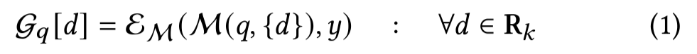

# eRAG 논문 리뷰

[Evaluating Retrieval Quality in Retrieval-Augmented Generation](https://dl.acm.org/doi/abs/10.1145/3626772.3657957)

### **Abstract**

- 기존의 end-to-end 평가방법은 계산 비용이 많이 들고, query-document relevance labels 기반으로 한 검색 모델 성능 평가는 downstream 성능과 낮은 상관관계를 보이는 경우가 많음.
- 이러한 배경에서 새로운 평가 방법인 eRAG를 제안함. eRAG에서는 검색 목록에 있는 각 문서를 RAG 시스템의 LLM에서 개별적으로 활용함(LLM as Judge로 별도의 LLM을 사용하는 것이 아닌 RAG 시스템 내에서 downstream task를 해결하기 위해 사용하는 LLM을 평가에 활용). 각 문서에 대해 생성된 출력은 downstream task ground truth labels 기준으로 평가되고 각 문서의 downstream performance가 해당 문서의 관련성 레이블로 사용됨.
- eRAG는 다양한 downstream task metrics를 활용하여 document-level annotations을 생성하며, 이를 set-based or ranking metrics를 사용해 통합함.
- eRAG는 기존의 방법들과 비교하여 downstream RAG 성능과 더 높은 상관관계를 보이며, 계산 효율성 면에서 상당한 이점을 제공

### 1 INTRODUCTION

- 전통적으로 RAG 평가는 주로 end-to-end 평가에 의존해 왔으며, 생성된 출력물을 ground truth references와 비교하는 방식을 포함한다. 이러한 평가는 RAG 시스템 내 검색 모델을 평가하는 데 있어 여러 한계를 가지고 있음.
    1. end-to-end 평가는 검색된 문서 중 어떤 문서가 생성된 출력물에 기여했는지에 대한 투명성이 부족함.
    2. 대규모 검색 결과를 LLM이 처리할 때 많은 시간과 계산 자원이 필요함.
    3. 많은 랭킹 시스템은 평가 및 최적화를 위해  interleaving(결과 목록에서 하나 이상의 문서를 대체) 방식에 의존하여 검색 결과에서의 미세한 변동도 RAG 파이프라인의 재계산을 필요로 함.
    4. 랭킹 모델을 최적화하려면 종종 **사용자 클릭**과 같은 document-level feedback이 필요함. 그러나 end-to-end **평가**는 검색 결과에 대해 list-level feedback만 제공
- human annotations은 RAG에서 검색 모델을 평가하는 잠재적인 해결책이 될 수 있지만,비용이 많이 듦. 최근에는 LLMs의 추론 및 텍스트 이해 능력을 활용하여, 검색 평가를 위해 문서에 주석을 추가하는 방식이 사용되고 있음. 이러한 접근법은 대체로 RAG 시스템 내 검색기를 인간의 선호도에 기반하여 평가하여, RAG에서 검색 모델의 주요 목표인 검색 결과를 활용한 LLM 지원에는 초점을 맞추지 못하고 있음.
- 이에 따라, open-domain question answering, fact verification, dialogue systems을 포함한 다양한 RAG 시스템을 광범위하게 조사한 결과, *KILT 벤치마크의 provenance labels(출처 라벨)과 같은 인간 주석을 활용하여 RAG 시스템 내 검색 모델을 평가하는 방법은 **RAG의 downstream성능과의 상관 관계가 매우 낮음**을 발견함. 이는 **평가된 지표와 RAG의 downstream 성능 간에 의미 있는 관계가 부족**하다는 점을 시사함
- 본 논문에서는 eRAG라는 새로운 접근 방식을 제안함. 이는 RAG 시스템 내 검색기를 평가하기 위한 방법으로, retrieved list에 있는 각 문서에 대해 LLM을 개별적으로 적용하고, LLM의 출력을 사용하여 list-level annotation이 아닌 document-level annotations을 제공함. 이러한 주석은accuracy, exact match, ROUGE과 같은 downstream 지표를 사용하여 얻음.
- 본 논문에서는 eRAG라는 새로운 접근 방식을 제안함. 이는 RAG 시스템 내 검색기를 평가하기 위한 방법으로, retrieved list에 있는 각 문서에 대해 LLM을 개별적으로 적용하고, LLM의 출력을 사용하여 document-level annotations을 제공함. 이러한 주석은accuracy, exact match, ROUGE과 같은 downstream 지표를 사용하여 얻고, set-based or ranking metric를 aggregation function으로 적용하여 각 검색 결과 목록에 대해 단일 평가 점수를 생성함.
- 제안된 접근 방식이 RAG 시스템의 downstream 성능과 높은 상관 관계를 가지며 end-to-end 평가와 비교하여 계산 효율성을 보임.

### 2 EVALUATING RETRIEVERS IN RAG

- R_k : ranked retrieval list
- G_q : E_M을 통해 생성된 라벨 (down stream evaluation을 통한 relevance score 측정) (document-level annotation을 의미하는듯)
- M : LLM 모델

- 만들어진 relevance score G_q와  set-based or ranking metric를 aggregation function을 사용하여 (MAP,MRR,NDCG등) 단일 평가 점수 생성

end-to-end evaluation의 running cost

- vanilla transformer의 경우 cost는 input length의 증가에 대해 이차적으로 증가(transformer의 attention구조 때문)

proposed  evaluation method의 running cost

- retrieved list에서 각 element별로 G_q를 만들기 때문에 ranked list의 길이 증가에 선형적으로 영향을 받음

### 3 EXPERIMENTS

How do different retrieval evaluation methods correlate with the end-to-end downstream performance in RAG?

- 가장 일반적으로 사용되는 접근법인 KILT Provenance와 LLM을 활용한 주석(Annotation with LLMs) 즉, 문서 수준의 관련성 레이블과 LLM을 사용하여 각 검색 문서에 관련성 레이블을 할당하는 방법이 LLM의 downstream 성능과의 상관관계가 가장 낮았음.
- 검색된 결과를 활용하는 소비자로서의 LLM이 검색 모델이 가장 높은 상관 관계를 보였음

How do different retrieval evaluation methods in RAG perform as the size of retrieval results increases?

- 검색된 문서 수와 관계없이, 제안된 평가 전략이 LLM의 downstream 성능과의 상관 관계에서 일관되게 더 높은 결과를 보임.
- 또한, 검색된 문서의 수가 증가함에 따라 상관 관계가 감소하는 경향이 관찰됐는데, 이는 직관적인 결과로, 모든 지표는 각 each document-relevance label을 독립적으로 평가하여 랭킹 목록 점수를 계산하는 반면, LLM은 전체 문서의 정보를 활용하여 작업을 수행하기 때문

How does our method correlate with the downstream RAG performance as the size of large language models increases?

- 일부 데이터셋에서는 작은 LLM(T5-small)이 더 높은 상관 관계를 보이는 반면, 다른 데이터셋에서는 큰 모델(T5-base)이 더 높은 상관 관계를 보임
- 하지만 모든 경우에서 상관 관계 차이가 유의미하지 않았음

How much more efficient is eRAG compared to the end-to-end evaluation?

- 추론 시간과 메모리 소비라는 두 가지 요소를 고려
- 추론 시간에서 eRAG는 평균적으로 end-to-end 평가보다 2.468배 빠릅니다.
메모리 소비에서
- eRAG와 엔드투엔드 평가 간의 메모리 소비를 비교하기 위해 두 가지 실험을 수행했는데
1. query-level configuration
    - end-to-end 평가가 하나의 쿼리를 평가하는 데 필요한 최대 메모리와, 동일한 쿼리를 평가하는 eRAG에서 요구되는 최대 메모리를 비교했습니다.
    - 이 비교를 위해 end-to-end 평가의 배치 크기를 1로 설정하고, eRAG에서는 end-to-end 평가에서 하나의 쿼리에 사용된 문서 수와 동일하게 설정했습니다.
2. document-level configuration
    - 두 방법 모두 배치 크기를 1로 설정하여, 가장 효율적인 구성에서 eRAG가 end-to-end 평가보다 얼마나 메모리 효율적인지를 평가했습니다.
- query-level configuration에서는 eRAG가 end-to-end 평가에 비해 7배에서 15배 더 높은 메모리 효율성을 보였고 document-level configuration에서는 30배에서 48배 더 높은 메모리 효율성을 보였음.

### 4 CONCLUSION

- 검색 모델을 평가하기 위한 새로운 접근 방식인 eRAG를 제안하며, eRAG는다운스트림 작업에서 LLM의 문서별 성능을 활용하여 관련성 레이블을 생성함
- 제안된 방식은 LLM의 downstram 성능과 매우 높은 상관관계를 보였으며 메모리 소비와 추론 시간 측면에서 end-to-end 평가보다 더 높은 효율성을 입증했습니다.